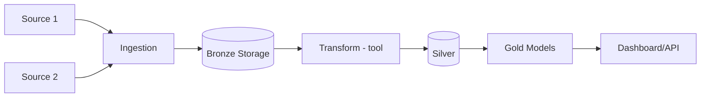

# Skill: Design Pipeline Architecture

## Purpose

Decide **how data flows from source to serving layer**, with **exactly one tool per category**. Ambiguity at this step is the #1 reason DE projects get stuck midway.

## When to stop at this skill

Only move to `/schema` when `docs/architecture.md` has: 1 pattern, 1 tool/category, 1 diagram, naming convention.

---

## Steps

### Step 1 — Choose a layering pattern

Pick **1 pattern** based on requirements from `docs/business_problem.md`:

| Pattern | Choose when |
|---------|-------------|
| **Medallion (Bronze/Silver/Gold)** | Default — clean separation of raw/cleaned/business-ready |
| **ELT** | Modern cloud DW, want to keep raw data, transform in-warehouse |
| **ETL** | Legacy system, need heavy pre-processing before loading |
| **Kappa** | Stream-only, no batch needed |
| **Lakehouse** | Need ACID on object store, unified batch + stream |

> For portfolio projects: **Medallion is the default**. Only choose otherwise if there's a specific reason from the business problem.

### Step 2 — Pick 1 tool per category

For each category, choose **exactly 1 tool** and document the reason:

| Category | Common choices | Selection criteria |
|----------|---------------|-------------------|
| **Orchestration** | Airflow / Dagster / Prefect | Airflow: large community, popular in job market. Dagster: asset-based, good for lineage. Prefect: modern API, easy local dev |
| **Object storage** | MinIO / S3 / GCS / ADLS | MinIO for local (S3-compatible). Cloud bucket if deploying to cloud |
| **Transformation** | dbt / Spark / pandas/polars | dbt: SQL + version control. Spark: large-scale distributed. pandas/polars: small-medium, Python-first |
| **Query engine / DW** | DuckDB / Snowflake / BigQuery | DuckDB: local/free, excellent analytics. Cloud DW if scale or portfolio target requires it |
| **Containerization** | Docker Compose | Always use Docker Compose for local reproducibility |

**Rule**: If unsure → pick the most popular option on the job market for your domain. Don't over-optimize early.

### Step 3 — Draw a data flow diagram

Draw using Mermaid (or ASCII) showing the full path:
```
[Source A] → [Ingestion] → [Bronze/Raw] → [Transform] → [Silver] → [Gold] → [Serving]
[Source B] ↗                  (storage)      (tool)      (storage)  (storage)  (dashboard/API)
```
Every arrow/box must have a **specific tool name**, never leave it blank.

### Step 4 — Define naming conventions

Commit to these early, don't defer them. Example:
```
Bronze:  raw.<entity>_raw           (or /data/bronze/<entity>/)
Silver:  staging.stg_<entity>       (or /data/silver/<entity>/)
Gold:    mart.fct_<entity>_<grain>  (or /data/gold/<entity>/)
         mart.dim_<entity>
```

### Step 5 — Document scale assumptions

Document current scale — this justifies every tool choice:
> "Pipeline processes ~[X] MB/day on a single machine — sufficient justification for DuckDB/pandas over Spark."

If scale changes later → revisit this step, don't swap tools without acknowledging the shift.

---

## Output format

Create `docs/architecture.md`:

```markdown
# Architecture — [Project Name]

## Pattern
[Medallion / ELT / ETL / Kappa / Lakehouse] — reason for choosing this pattern

## Scale Assumption
[X MB/GB per day, single machine / distributed, X sources]

## Tool Stack

| Category | Tool | Reason |
|----------|------|--------|
| Orchestration | [tool] | [reason] |
| Object storage | [tool] | [reason] |
| Transformation | [tool] | [reason] |
| Query engine | [tool] | [reason] |
| Containerization | Docker Compose | Reproducibility |

## Data Flow

[Mermaid diagram or ASCII art]


## Naming Convention
- Bronze: `raw.<entity>`
- Silver: `stg_<entity>`
- Gold: `fct_<entity>_<grain>`, `dim_<entity>`

## Layer Contracts
| Layer | Allowed transformations | Output guarantees |
|-------|------------------------|-------------------|
| Bronze | None — raw as-is | Original structure + metadata tags |
| Silver | Clean, dedupe, type cast | No duplicates, no nulls on PK |
| Gold | Aggregation, business logic | Answers analytical questions at correct grain |

## Failure Modes
- [List at least 2-3 known failure modes and how to handle them]
```

---

## DONE WHEN

- [ ] 1 pattern chosen with a reason
- [ ] 1 tool per category, no "TBD"
- [ ] Mermaid/ASCII diagram has specific tool names at each step
- [ ] Naming convention committed
- [ ] Scale assumption clearly documented

---

## Next Step

After done → run `/schema` to design your DW schema (Fact/Dimension tables).

> Reference: `skills/arch/references/patterns.md` — detailed ETL/ELT/Lambda/Kappa/Lakehouse tradeoffs.
> `phases/phase-2-architecture.md` — deeper methodology.
