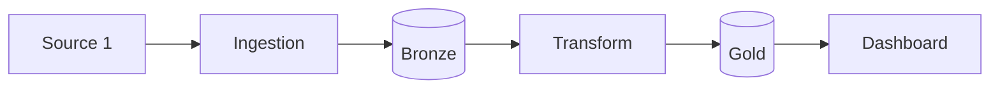

# Skill: Write Documentation

## Purpose

Make the project **understandable and runnable** by someone else — portfolio reviewer, hiring manager, or future-you — within 10 minutes of looking at the repo. Good documentation is what separates a junior project from a senior project in a portfolio review.

## When to stop at this skill

Done when the README is sufficient to clone + run + understand in 10 minutes, data lineage exists, and cost notes are included.

This skill follows `/ci`. The pipeline is complete once README, lineage, and cost analysis are committed.

---

## Steps

### Step 1 — README (highest priority)

The README must answer **4 questions** a reviewer will have:
1. **What**: What does this pipeline do? (1 paragraph)
2. **Why**: What problem does it solve? (business problem)
3. **How**: What does the architecture look like? (diagram)
4. **Run it**: How do I run it locally? (exact commands)

### Step 2 — Data lineage

If using dbt:
```bash
dbt docs generate
dbt docs serve  # http://localhost:8080 — take a screenshot
```

If not using dbt → write a manual lineage table in the docs:
```
Source A → ingestion/source_a/ingest.py → Bronze → stg_source_a → fct_candles → dashboard
```

### Step 3 — Cost analysis

Even if the project runs free (local/free-tier), include a note:
> "At current scale (~X MB/day), estimated cost if running on cloud:"

Estimate for the current stack:
| Service | Scale | Cost/month |
|---------|-------|-----------|
| Cloud storage (S3/GCS) | X GB | $Y |
| Compute (EC2/GCE) | X hours | $Y |
| Data warehouse | X TB scanned | $Y |
| **Total** | | **$Y/month** |

---

## Output

### `README.md`:

```markdown
# <Project Name>

> <1-sentence description: what pipeline, what data, what problem it solves>

[](link)

## Business Problem

<Copy from docs/business_problem.md — Context + Problem + Solution (2-3 paragraphs)>

**Analytical questions this pipeline answers:**
1. <Question 1>
2. <Question 2>
3. <Question 3>

## Architecture

<Mermaid diagram from docs/architecture.md>



**Stack**: <list tools> | **Scale**: <X MB/day, single machine>

## Quick Start

**Prerequisites**: Docker, Python 3.11+, Git

```bash
# 1. Clone
git clone https://github.com/<user>/<repo>
cd <repo>

# 2. Environment
cp .env.template .env
# Edit .env and fill in API keys

# 3. Start services
docker compose up -d
# Wait ~30s for Airflow UI at http://localhost:8080 (admin/admin)

# 4. Run pipeline (first time)
docker compose exec airflow-scheduler \
    airflow dags trigger <project>_pipeline

# 5. View dashboard
streamlit run serving/app.py
```

## Project Structure

```
<repo>/
├── contracts/        # Source data contracts (YAML)
├── ingestion/        # Bronze ingestion scripts (1 per source)
├── dags/             # Airflow DAGs
├── models/           # dbt models (Silver + Gold)
├── quality/          # DQ checks + contract validation
├── serving/          # Dashboard / API
├── tests/            # Unit + schema tests
├── docs/             # Architecture, DW schema, DQ reports
└── docker-compose.yml
```

## Demo

<Embed screenshot or GIF of dashboard>


## Data Lineage

| Source | Bronze | Silver | Gold | Serving |
|--------|--------|--------|------|---------|
| <Source 1> | `raw_<source1>` | `stg_<source1>` | `fct_<fact>` | Dashboard Q1 |
| <Source 2> | `raw_<source2>` | `stg_<source2>` | `dim_<dim>` | Dashboard Q2 |

<dbt docs screenshot or link if available>

## Cost Analysis

Running locally (free). Estimated cloud cost at current scale (~<X> MB/day):

| Service | Usage | Est. Cost/month |
|---------|-------|----------------|
| Storage (<S3/GCS>) | <X> GB | $<Y> |
| Compute (<EC2/GCE>) | <X> hrs | $<Y> |
| Orchestration (<Airflow/MWAA>) | 1 env | $<Y> |
| **Total** | | **~$<Y>/month** |

At 10x scale (~<X*10> MB/day): **~$<Y*10>/month** — would consider <optimization strategy>.

## Security Notes

- Credentials via `.env` (gitignored) — production would use Secrets Manager / Vault
- No PII in Gold layer
- Data retained for <X> days per source SLA

## Contributing

<Optional — skip for solo portfolio projects>
```

---

## DONE WHEN

- [ ] README covers: what, why, architecture diagram, exact run commands
- [ ] `docs/demo/` folder has at least 1 screenshot of the running dashboard
- [ ] Data lineage table (manual or dbt docs) exists — source → bronze → silver → gold → serving
- [ ] Cost analysis note with at least 2 scenarios (current scale + 10x)
- [ ] README is verifiable from fresh clone following the Quick Start instructions (self-test)

---

## Next Step

Previous: `/ci`.

**Project complete!** Your data engineering pipeline is fully built, tested, documented, and ready for portfolio review or production use.

If writing the README exposes an unclear architecture decision, revisit `/arch` rather than hand-waving in the docs.

---

## References

- Phase deep-dive: `phases/phase-9-governance.md`
- dbt lineage docs: `implementation/transformation/dbt-patterns.md`
- Data contracts: `implementation/quality/data-quality-patterns.md`
- Operations guide: `commands/data-pipeline.md`
