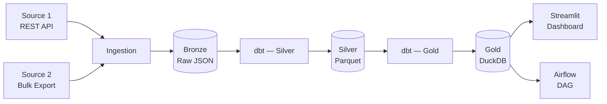

# README.md Template
# Copy to: README.md (project root)
# Fill every [PLACEHOLDER] — delete comments before publishing

# [Project Name]

> [One sentence: what pipeline, what data sources, what business problem it solves]

[](https://github.com/[USER]/[REPO]/actions/workflows/ci.yml)
[](https://python.org)
[](LICENSE)

---

## Business Problem

[2-3 sentences: the context, the pain, the solution. Copy from docs/business_problem.md]

**This pipeline answers:**
1. [Analytical question 1 from business_problem.md]
2. [Analytical question 2]
3. [Analytical question 3]

**Success metric**: [Not "it runs" — tie to answering the questions above within X hours freshness]

---

## Architecture

[Copy Mermaid diagram from docs/architecture.md]



| Category | Tool | Reason |
|----------|------|--------|
| Orchestration | [tool] | [1-line reason] |
| Storage | [tool] | [1-line reason] |
| Transformation | [tool] | [1-line reason] |
| Query engine | [tool] | [1-line reason] |

**Scale**: ~[X] MB/day · single machine · [N] sources

---

## Quick Start

**Prerequisites**: Docker Desktop, Python 3.11+, Git

```bash
# 1. Clone the repository
git clone https://github.com/[USER]/[REPO].git
cd [REPO]

# 2. Configure environment
cp .env.template .env
# Edit .env and fill in your API keys
# Required: [list the env vars that need real values]

# 3. Start infrastructure
docker compose up -d
# Wait ~30 seconds for services to initialize

# 4. Verify services
curl http://localhost:8080/health   # Airflow (admin/admin)
curl http://localhost:9001          # MinIO console

# 5. Run pipeline (first time — backfill last 7 days)
docker compose exec airflow-scheduler \
    airflow dags trigger [project]_pipeline --conf '{"backfill_days": 7}'

# 6. Open dashboard
pip install -r requirements.txt
streamlit run serving/app.py
# Open: http://localhost:8501
```

**Total setup time**: ~10 minutes on a fresh machine.

---

## Dashboard


[Optional: embed GIF or link to video demo]

---

## Project Structure

```
[REPO]/
├── contracts/           # Source data contracts (YAML) — what we can rely on
│   └── source-*.yaml
│
├── ingestion/           # Bronze layer — one script per source
│   └── <source>/
│       └── ingest.py
│
├── dags/                # Airflow DAGs — orchestrates the full pipeline
│   └── [project]_pipeline.py
│
├── models/              # dbt transformation models
│   ├── staging/         # Silver: cleaned, deduplicated
│   └── marts/           # Gold: analytics-ready (Fact + Dim)
│
├── quality/             # Runtime data quality checks
│   ├── dq_checks.py
│   └── contract_check.py
│
├── serving/             # Dashboard and/or API
│   └── app.py
│
├── tests/               # Unit and logic tests
│
├── docs/                # Architecture, DW schema, DQ reports
│   ├── business_problem.md
│   ├── architecture.md
│   ├── dw_schema.md
│   └── demo/
│
└── docker-compose.yml   # Full local stack
```

---

## Data Lineage

| Source | Bronze | Silver | Gold | Serving |
|--------|--------|--------|------|---------|
| [Source 1] | `raw_[source1]/` | `stg_[source1]` | `fct_[fact]` | Dashboard — Q1, Q2 |
| [Source 2] | `raw_[source2]/` | `stg_[source2]` | `dim_[dim]` | Dashboard — Q3 |

[If using dbt: `dbt docs generate && dbt docs serve` for full interactive lineage]

---

## Cost Analysis

Running locally (cost: **$0**).

Estimated if migrated to cloud at current scale (~[X] MB/day):

| Service | Usage | Est. Cost/month |
|---------|-------|-----------------|
| Cloud storage ([S3/GCS]) | [X] GB | $[Y] |
| Compute ([EC2/GCE], [size]) | [X] hrs/day | $[Y] |
| Orchestration (MWAA/Composer) | 1 env | $[Y] |
| **Total** | | **~$[Y]/month** |

At 10× scale (~[X×10] MB/day): ~$[Y×10]/month — would optimize by [switching to serverless compute / columnar compression / etc.].

---

## Security Notes

- All credentials via `.env` (gitignored) — production would use AWS Secrets Manager or HashiCorp Vault
- No PII in Gold layer — [describe any PII handling if applicable]
- Data retained for [X] days per source SLA

---

## 🧪 Running Tests

```bash
# Unit + logic tests
pytest tests/ -v

# dbt schema + logic tests (requires running DuckDB)
dbt test

# All DQ checks against live data
python quality/dq_checks.py

# Contract validation
python quality/contract_check.py
```

---

## Roadmap / Known Limitations

- [ ] [Limitation 1 — e.g. "Rate limit forces daily batch; real-time would require paid tier"]
- [ ] [Limitation 2 — e.g. "No SCD Type 2 for company dim — historical sector changes not tracked"]
- [ ] [Future enhancement — e.g. "Add sentiment analysis from news API"]
