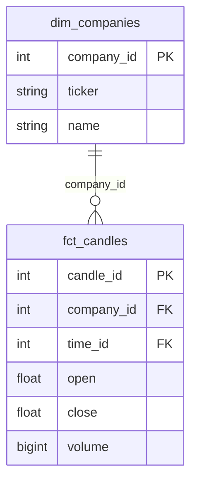

# Skill: Design Data Warehouse Schema

## Purpose

Translate **analytical questions** from `docs/business_problem.md` into concrete **Fact + Dimension tables** with clear grain, PK/FK, and relationships. This schema is the blueprint for `/transform` — without it, transformation is guesswork.

## When to stop at this skill

Only move to `/env` when `docs/dw_schema.md` has: every analytical question mapped to ≥1 Fact table, every Fact table has defined grain, and every Dim has a clear PK/FK.

## Steps

### Step 1 — Determine grain for each Fact table

Grain = **the smallest unit a single row in the Fact table represents**. This is the most important design decision.

For each analytical question, ask: *"What does one row in this table represent?"*

**Examples:**
- "Daily trading volume per stock" → grain: 1 stock × 1 day
- "News sentiment per article per stock" → grain: 1 article × 1 stock

If two questions need different grains → they need separate Fact tables.

### Step 2 — Identify Dimension tables

Dimensions = **descriptive context** for each measurement in the Fact table. Typically:
- **Who/What**: entity (company, product, user, news article)
- **When**: time (dim_date with day/week/month/quarter/year)
- **Where**: geography, region, exchange
- **What kind**: category, sector, topic

> **Rule**: If a field in the Fact table is descriptive (not numeric), it probably belongs in a Dim.

### Step 3 — Design each table

For each table, define:
- **PK** (primary key)
- **FK** (foreign keys → dim tables)
- **Measures** (numeric columns in the Fact table)
- **Attributes** (descriptive columns in the Dim table)

### Step 4 — Choose a schema pattern

| Pattern | When to use |
|---------|-------------|
| **Star Schema** | 1 Fact + multiple direct Dims. Simple, fast queries. Default. |
| **Snowflake Schema** | Dims are further normalized (Dim of Dim). Better storage but more complex joins. |
| **Galaxy Schema** | Multiple Fact tables sharing Dims. Use when modeling multiple business processes. |

### Step 5 — Map analytical questions → tables

Verify every question in `docs/business_problem.md` can be answered with SQL from this schema:

```sql
-- "Top 10 stocks by volume change last week"
SELECT c.ticker, f.volume, t.week
FROM fct_candles f
JOIN dim_companies c ON f.company_id = c.company_id
JOIN dim_time t ON f.time_id = t.time_id
WHERE t.week = CURRENT_WEEK - 1
ORDER BY f.volume DESC LIMIT 10;
```

If you can't write the SQL → the schema isn't complete; go back and adjust.

## Output format

Create `docs/dw_schema.md`:

````markdown
# Data Warehouse Schema — [Project Name]

## Schema Pattern
[Star / Snowflake / Galaxy] — reason for choosing

## Analytical Question → Table Mapping

| Analytical Question | Fact Table | Dim Tables Used |
|--------------------|-----------|-----------------|
| [Question 1] | fct_xxx | dim_yyy, dim_time |
| [Question 2] | fct_zzz | dim_yyy, dim_www |

## Dimension Tables

### dim_<entity>
**Grain**: 1 row = 1 unique [entity]
**Update pattern**: [SCD Type 1 / Type 2 / Static]

| Column | Type | PK/FK | Description |
|--------|------|-------|-------------|
| <entity>_id | integer | PK | Surrogate key |
| [natural key] | string | - | Business identifier |
| [attribute 1] | string | - | ... |

### dim_time
**Grain**: 1 row = 1 unique date

| Column | Type | Description |
|--------|------|-------------|
| time_id | integer | PK (YYYYMMDD format) |
| date | date | Full date |
| day_of_week | integer | 1=Monday |
| week | integer | ISO week number |
| month | integer | 1-12 |
| quarter | integer | 1-4 |
| year | integer | |
| is_trading_day | boolean | Optional, domain-specific |

## Fact Tables

### fct_<measurement>
**Grain**: 1 row = [grain definition in plain language]
**Update pattern**: [append-only / upsert / full refresh]

| Column | Type | PK/FK | Description |
|--------|------|-------|-------------|
| <fact>_id | integer | PK | Surrogate key |
| <dim1>_id | integer | FK → dim_<dim1> | |
| time_id | integer | FK → dim_time | |
| [measure 1] | number | - | [unit + description] |
| [measure 2] | number | - | [unit + description] |

## Relationships
[Mermaid ER diagram]


````

## DONE WHEN

- [ ] Every analytical question mapped to ≥1 Fact table (clear mapping table)
- [ ] Every Fact table has grain defined in plain language
- [ ] Every Dim table has a clear PK
- [ ] Every FK in a Fact table references the correct Dim
- [ ] Can write SQL for at least 2 analytical questions from this schema

## Next Step

Previous: `/arch`. After done → run `/env` to set up your reproducible development environment.

## References

- Template: `skills/schema/assets/dw_schema_template.md`
- Phase deep-dive: `phases/phase-2-architecture.md`
- Next phase: `phases/phase-3-environment-setup.md`
- Previous skill: `skills/arch/SKILL.md`
- Next skill: `skills/env/SKILL.md`
