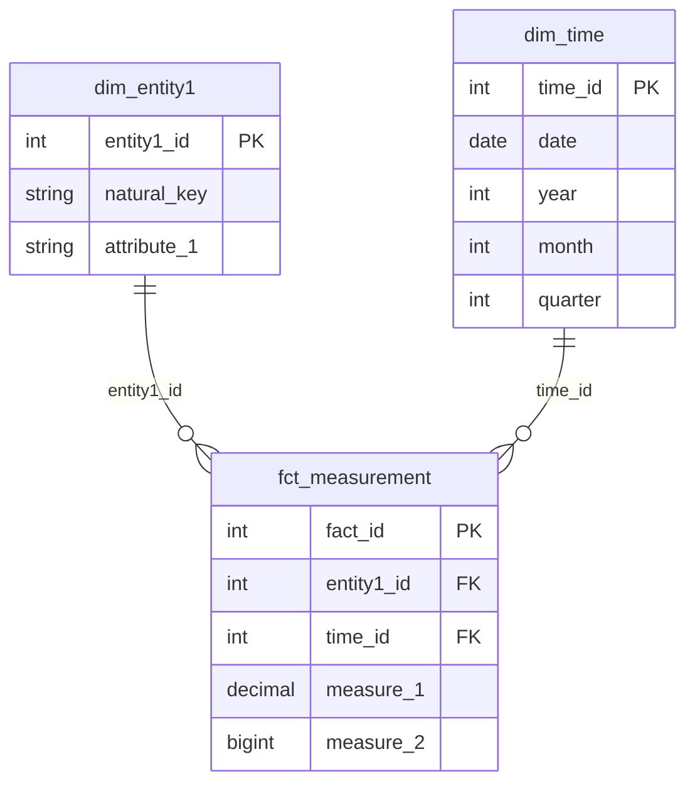

# Data Warehouse Schema — [Project Name]
# Copy to: docs/dw_schema.md
# Fill every section before writing transformation code.

## Schema Pattern
[Star / Snowflake / Galaxy] — reason for choice

_Star Schema_: 1 Fact + multiple Dims directly attached. Simple joins, fast queries. Default.
_Snowflake_: Dims are normalized further (Dim of Dim). Better storage, more complex joins.
_Galaxy_: Multiple Fact tables share Dim tables. Use when modeling multiple business processes.

---

## Analytical Question → Table Mapping

| # | Analytical Question | Fact Table | Dim Tables |
|---|--------------------|-----------| -----------|
| 1 | [Question 1] | fct_xxx | dim_yyy, dim_time |
| 2 | [Question 2] | fct_xxx | dim_zzz, dim_time |
| 3 | [Question 3] | fct_www | dim_yyy |

_Every question must map to at least one Fact table. If it doesn't, either add a table or revise the question._

---

## Dimension Tables

### dim_time
**Grain**: 1 row = 1 unique date
**Update pattern**: Static (pre-generated for 10 years)
**Source**: Generated — no ingestion needed

| Column | Type | PK | Description |
|--------|------|----|-------------|
| time_id | INTEGER | PK | YYYYMMDD format (e.g. 20240115) |
| date | DATE | | Full date |
| day_of_week | INTEGER | | 1=Monday, 7=Sunday |
| day_name | VARCHAR | | "Monday", "Tuesday", etc. |
| week | INTEGER | | ISO week number |
| month | INTEGER | | 1–12 |
| month_name | VARCHAR | | "January", etc. |
| quarter | INTEGER | | 1–4 |
| year | INTEGER | | |
| is_weekend | BOOLEAN | | |
| [domain-specific] | BOOLEAN | | e.g. is_trading_day, is_holiday |

---

### dim_[entity_1]
**Grain**: 1 row = 1 unique [entity]
**Update pattern**: [SCD Type 1 (overwrite) / SCD Type 2 (history) / Static]
**Source**: [which source contract provides this]

| Column | Type | PK/FK | Description |
|--------|------|-------|-------------|
| [entity]_id | INTEGER | PK | Surrogate key |
| [natural_key] | VARCHAR | | Business identifier (e.g. ticker, product_code) |
| [attribute_1] | VARCHAR | | [description] |
| [attribute_2] | VARCHAR | | [description] |
| valid_from | DATE | | SCD Type 2 only |
| valid_to | DATE | | SCD Type 2 only — NULL means current |
| is_current | BOOLEAN | | SCD Type 2 only |

---

### dim_[entity_2]
**Grain**: 1 row = 1 unique [entity]
**Update pattern**: [SCD Type 1 / 2 / Static]
**Source**: [source contract]

| Column | Type | PK/FK | Description |
|--------|------|-------|-------------|
| [entity]_id | INTEGER | PK | Surrogate key |
| [natural_key] | VARCHAR | | Business identifier |
| [attribute_1] | VARCHAR | | |

---

## Fact Tables

### fct_[measurement]
**Grain**: 1 row = [one sentence describing what one row represents]
_Example: "1 stock × 1 trading day" or "1 article × 1 mentioned stock"_
**Update pattern**: [append-only / upsert by natural key / full refresh by partition]
**Source(s)**: [which source contracts provide the data for this table]

| Column | Type | PK/FK | Unit | Description |
|--------|------|-------|------|-------------|
| [fact]_id | INTEGER | PK | | Surrogate key |
| [dim1]_id | INTEGER | FK → dim_[dim1] | | |
| [dim2]_id | INTEGER | FK → dim_[dim2] | | |
| time_id | INTEGER | FK → dim_time | | |
| [measure_1] | DECIMAL(12,4) | | [unit e.g. USD] | [description] |
| [measure_2] | BIGINT | | [unit e.g. shares] | [description] |
| [derived_measure] | DECIMAL(8,4) | | [unit] | [formula: (x - y) / y * 100] |

---

## Entity Relationship Diagram



---

## Sample SQL Validation

_Write at least 2 SQL queries proving the schema can answer the analytical questions. If you can't write the SQL, the schema is incomplete._

```sql
-- Q1: [Analytical question 1]
SELECT
    e.[natural_key],
    t.date,
    f.[measure_1]
FROM fct_[measurement] f
JOIN dim_[entity1] e ON f.entity1_id = e.entity1_id
JOIN dim_time t ON f.time_id = t.time_id
WHERE t.date BETWEEN '[start]' AND '[end]'
ORDER BY f.[measure_1] DESC
LIMIT 10;

-- Q2: [Analytical question 2]
SELECT
    ...
```
